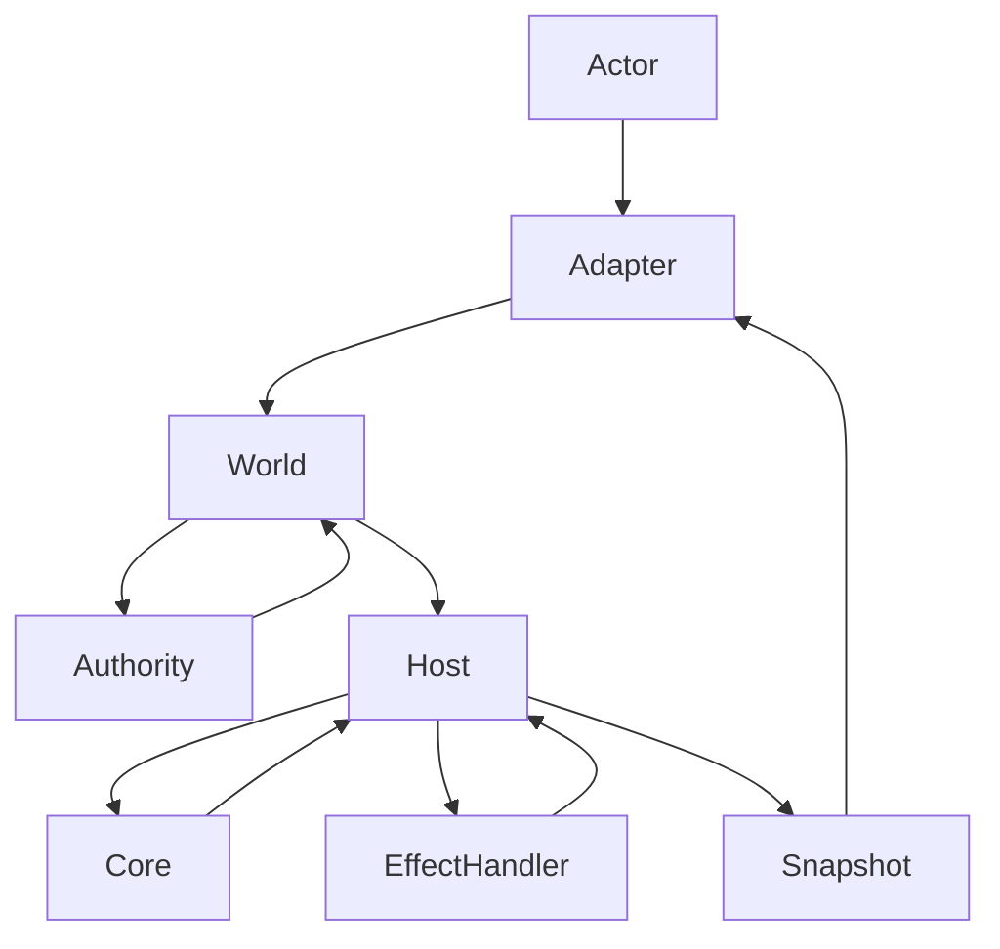

**03. Intent부터 Snapshot까지: 전체 실행 흐름**
이 장은 "Intent가 제출된 뒤 Snapshot이 바뀌기까지"의 흐름을 한 눈에 보여줍니다.

**핵심 원칙**
- Core는 계산만 합니다.
- Host는 실행만 합니다.
- World는 승인과 기록만 합니다.
- 모든 정보는 Snapshot으로만 흐릅니다.

**시퀀스 다이어그램**

**단계별 설명**
1. 사용자가 UI/API 이벤트를 발생시키면 Adapter가 Intent로 변환합니다.
2. World가 Actor의 권한과 정책을 평가합니다.
3. 승인된 Intent만 Host로 전달됩니다.
4. Host는 Core에 계산을 요청합니다.
5. Core는 Patch와 Requirement를 반환합니다.
6. Requirement가 있다면 Host가 Effect를 실행합니다.
7. Effect 결과 Patch를 반영한 뒤 Core를 다시 호출합니다.
8. 최종 Snapshot이 갱신되고 UI는 새 상태를 받습니다.

**자주 헷갈리는 포인트**
- Flow는 실행 상태를 저장하지 않습니다. 항상 처음부터 계산하고 Snapshot으로 완료 여부를 판단합니다.
- Effect는 Core가 실행하지 않습니다. Core는 선언만 합니다.
- 실패도 값입니다. 에러는 Patch로 Snapshot에 기록됩니다.

**현재 Java 구현 흐름에서의 차이 (2026-02-11 기준)**  
- Host는 동기 while 루프 기반 최소 실행기이며, TS의 mailbox/runner/job 모델은 아직 미도입입니다.  
- Host 상태는 `$host` 네임스페이스 경로가 반영되어 있고, `$mel` 관련 런타임 정합이 후속 과제입니다.

**Java 개발 팁**
- Core는 **테스트 가능한 순수 모듈**로 분리하세요.
- Host는 I/O, 트랜잭션, 재시도, 메시징을 책임집니다.
- World 정책은 전략(Policy) 객체로 분리해 교체 가능하게 설계하세요.

**체크포인트 질문**
1. 승인되지 않은 Intent는 어디에서 차단되나요.
2. Effect가 필요한 순간에 Core는 왜 "멈추는"가요.
3. Host가 다시 Core를 호출하는 이유는 무엇인가요.
