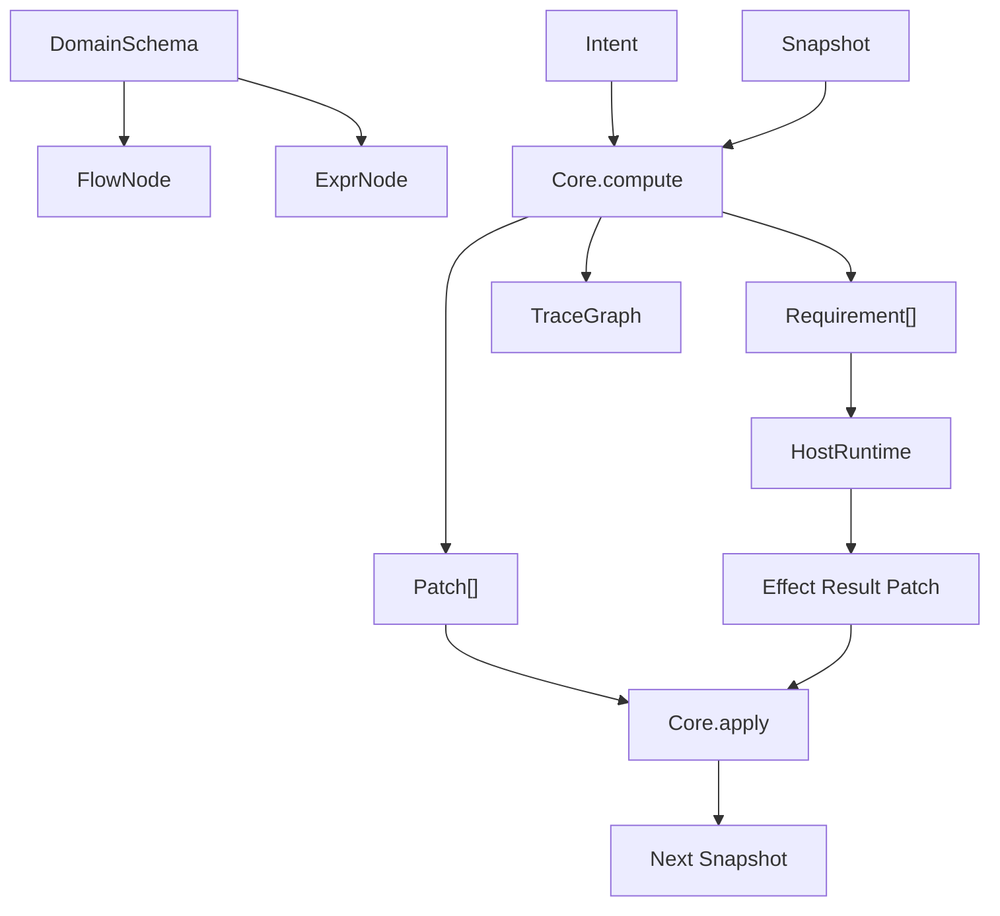
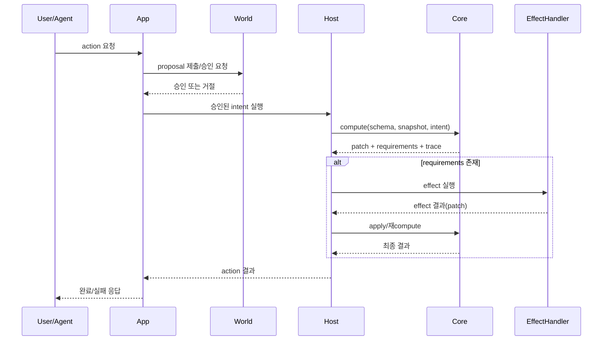
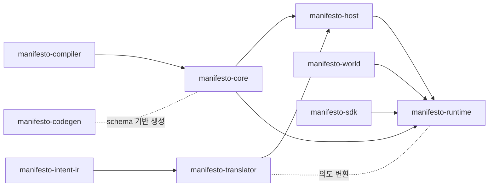

# 03. 핵심 개념 연관관계와 전체 실행 흐름

이 장은 "개념들 사이 관계"를 먼저 이해시키는 데 목적이 있습니다.

## 1) 개념 연관관계 (정적 구조)

해석:
- `Schema`가 계산 규칙(Flow/Expr)을 정의합니다.
- `Core.compute`는 `Intent + Snapshot + Schema`를 받아 `Patch/Requirement/Trace`를 만듭니다.
- `Requirement`가 있으면 Host가 외부 실행 후 patch를 돌려줍니다.
- 최종적으로 `apply`를 통해 새 snapshot이 만들어집니다.

## 2) 런타임 실행 순서 (동적 흐름)

## 3) 모듈 의존 관계

핵심 포인트:
- 실행 중심 경로는 `sdk -> runtime -> world -> host -> core`입니다.
- 개발 생산성 경로는 `compiler`, `intent-ir`, `translator`, `codegen`입니다.
- `core`가 계산의 기준점이며 다른 모듈이 이를 둘러싸는 구조입니다.

## 4) 신입 개발자 체크리스트
- `Core`가 DB/API를 직접 호출하면 설계 위반입니다.
- `Host`가 Snapshot을 임의로 수정하면 설계 위반입니다.
- `World` 승인 없이 실행하면 거버넌스가 깨집니다.

<!-- NEXT_DOC_START -->
---

## 다음 문서
- [04. 모듈별 역할 요약 (아키텍처 지도)](./04-core-api.md)
<!-- NEXT_DOC_END -->
