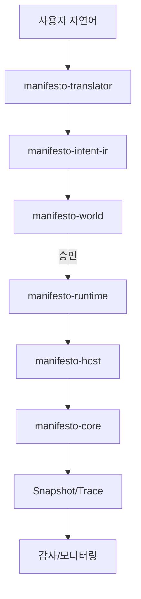

# 07. 이 프로젝트로 할 수 있는 일 (LLM 활용 포함)

## 1) 이 프로젝트로 할 수 있는 대표 업무
- 규칙 기반 업무 자동화(승인/거절/상태 전이)
- 운영 이벤트 감사 추적(누가, 왜, 무엇을 변경했는지)
- 정책 중심 워크플로우(권한/역할/조건 기반 실행 통제)
- 도메인 규칙 검증 및 시뮬레이션

## 2) LLM 관점에서 가능한 활용

### A. 자연어 명령을 안전한 Intent로 변환
- 사용자 입력: "A 고객 주문 취소해줘"
- translator/intent-ir: 구조화된 intent로 변환
- world: 권한 및 정책 검증
- host/core: 승인된 요청만 실행

### B. LLM을 "제안자", World를 "결정자"로 분리
- LLM은 제안(초안)만 수행
- 최종 실행 가능성은 world policy가 판단
- 오작동/과도 권한 위험을 줄일 수 있음

### C. 결과 설명 가능성 확보
- LLM이 제안한 경로 + core trace를 함께 기록
- 운영/감사 보고서에 근거 데이터 제공 가능

## 3) LLM 연동 아키텍처 예시

## 4) 왜 Manifesto 조합이 LLM에 유리한가
- 실행 전 검증(정책/스키마/진단)
- 실행 중 통제(host effect 경계)
- 실행 후 설명(trace + decision record)

## 5) 실무 적용 예시
- 고객센터 자동 처리: 상담 요약 -> intent -> 정책 승인 -> 처리
- 운영 작업 자동화: 배치 실행 요청 -> 승인 -> 실행 -> 감사 기록
- 백오피스 승인 시스템: LLM 초안 작성 + 사람 승인(HITL) + 실행

<!-- NEXT_DOC_START -->
---

## 다음 문서
- [08. 모듈 상세: manifesto-core](./08-module-core.md)
<!-- NEXT_DOC_END -->
