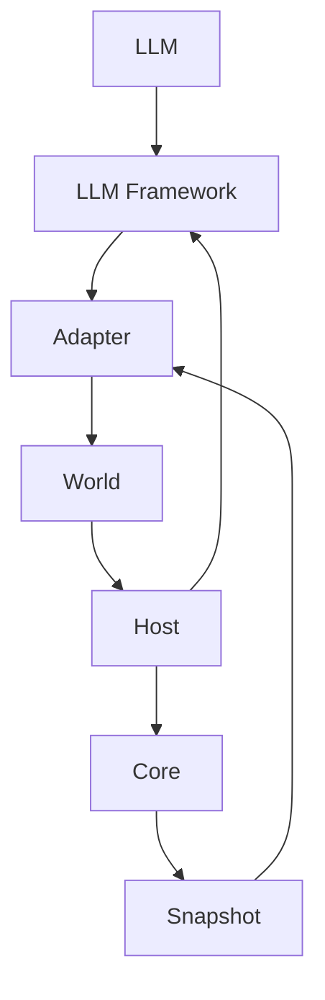

**07. LLM 통합 시 기대 효과**
이 장은 Manifesto를 LLM 프레임워크와 결합했을 때 "어떤 결과를 기대할 수 있는지"를 예측 관점으로 정리합니다. 실제 결과는 구현 방식과 운영 정책에 따라 달라질 수 있습니다.

**전제**
- Manifesto는 "결정적 계산 + 거버넌스 + 감사 추적"에 강점이 있습니다.
- LLM 프레임워크는 "LLM 호출과 에이전트/그래프 실행"을 돕습니다.
- 두 시스템의 결합은 "생각(LLM)"과 "실행(Manifesto)" 사이의 경계를 명확히 설계하는 데 효과적입니다.

**기대 효과 1: LLM의 행동을 `Intent`로 격리**
- LLM의 출력은 자연어가 아닌 `Intent`로 구조화됩니다.
- 결과적으로 "왜 이 행동이 일어났는지"를 `Intent` 수준에서 추적할 수 있습니다.
- 예상 결과: 추론(LLM)과 실행(Host)을 분리해 재현성과 감사 가능성이 증가합니다.

**기대 효과 2: 거버넌스(`Authority`)를 통한 안전장치**
- LLM이 제안한 `Intent`는 World에서 승인/거절 규칙을 거칩니다.
- 예상 결과: 정책 기반 필터링, HITL 승인, 롤백 가능성이 높아집니다.

**기대 효과 3: 흐름의 안정성(Determinism + Trace)**
- LLM 그래프 실행은 어떤 노드가 어떤 순서로 실행되었는지 남깁니다.
- Manifesto의 Trace는 계산이 왜 이 결과를 만들었는지 설명합니다.
- 예상 결과: LLM 추론 과정과 상태 전이 과정이 함께 기록되어 디버깅과 감사가 쉬워집니다.

**기대 효과 4: 상태 기반 재실행과 복구 용이성**
- Snapshot을 저장해두면 동일한 조건에서 재실행이 가능합니다.
- 예상 결과: 에이전트 실패 복구, 재현 실험, 시뮬레이션에 유리합니다.

**기대 효과 5: 도메인 규칙의 일관성 보장**
- LLM이 창의적으로 행동해도 최종 변경은 스키마와 Flow 규칙을 따릅니다.
- 예상 결과: 도메인 규칙을 위반하는 행동이 원천 차단됩니다.

**어떤 형태의 결합이 가능한가**
1. **LLM 도구 호출 -> Intent 생성**
LLM이 Tool을 호출하면, 그 호출을 Manifesto Intent로 매핑합니다.  
장점: "도구 실행"을 "의도"로 승격시켜 통제 가능.

2. **그래프 노드 -> Intent/Effect 연동**
그래프 노드에서 Intent를 생성하거나, Effect 실행 결과를 다음 노드 입력으로 사용합니다.  
장점: 그래프 실행과 상태 전이가 일관된 기록을 갖습니다.

3. **LLM -> Proposal 생성 -> World 승인 -> Host 실행**
LLM은 Proposal만 만들고, 승인 여부는 World 규칙이 결정합니다.  
장점: LLM의 권한을 제한하고 감시 가능한 구조를 만듭니다.

**예상 아키텍처(개념)**



**LLM -> Intent 구조화 예시**

**자연어 입력**
- "로봇 배송을 시작해줘. 주문 번호는 2025-0007, 목적지는 A-12야."

**의도(Intent) 구조화 예시**
```json
{
  "type": "delivery.start",
  "input": {
    "orderId": "2025-0007",
    "destination": "A-12"
  }
}
```

**Java 포팅 고려 사항 (2026-02-11 기준)**  
- World/Authority 레이어의 기본 경로는 구현되었고 승인/거절/실행 terminal 흐름 테스트가 반영되었습니다.  
- LLM 통합의 TS 최신 기준은 `intent-ir` + `translator` 계층이며, Java 포팅은 아직 미착수입니다.  
- Host 정책(재시도/실패 누적)과 App/World 저장 정합, `$mel` 런타임 경계 정렬이 결합 안정성의 다음 관건입니다.

**체크포인트 질문**
1. LLM 결과를 Intent로 변환했을 때 얻는 이점은 무엇인가요.
2. World 승인 없이 Host가 실행하면 어떤 위험이 생길까요.
3. Snapshot 기반 재실행이 중요한 이유는 무엇인가요.
